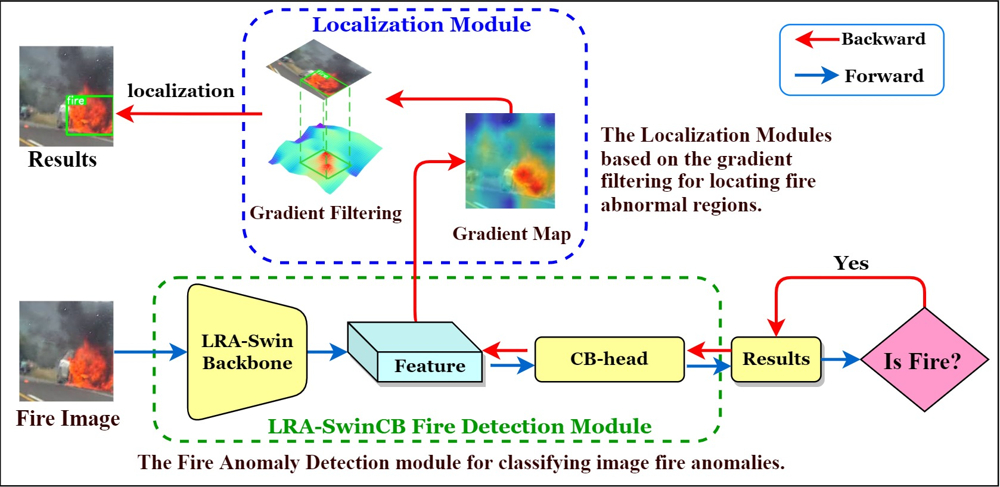

# LRA-SwinCB: Fire Anomaly Detection and Localization using Low-Rank Adaptation

## Overview

This repository contains the implementation of **LRA-SwinCB**, a fire anomaly detection framework that integrates:

- **Swin Transformer**: A powerful backbone model for extracting deep features.
- **Classification Boost head (CB-head) Module**: For channel and spatial feature enhancement.
- **Low-Rank Adaptation (LRA)**: A parameter-efficient fine-tuning approach to improve generalizability.
- **Gradient Filtering Algorithm**: To precisely localize fire anomalies using backward propagation gradients.

## References Codes

- [github.com/microsoft/Swin-Transformer](https://github.com/microsoft/Swin-Transformer)
- [github.com/JamesQFreeman/LoRA-ViT](https://github.com/JamesQFreeman/LoRA-ViT)
- [github.com/ramprs/grad-cam](https://github.com/ramprs/grad-cam)

## License 
This project is licensed under the Apache 2.0 License, please click [LICENSE](LICENSE) for more details.

